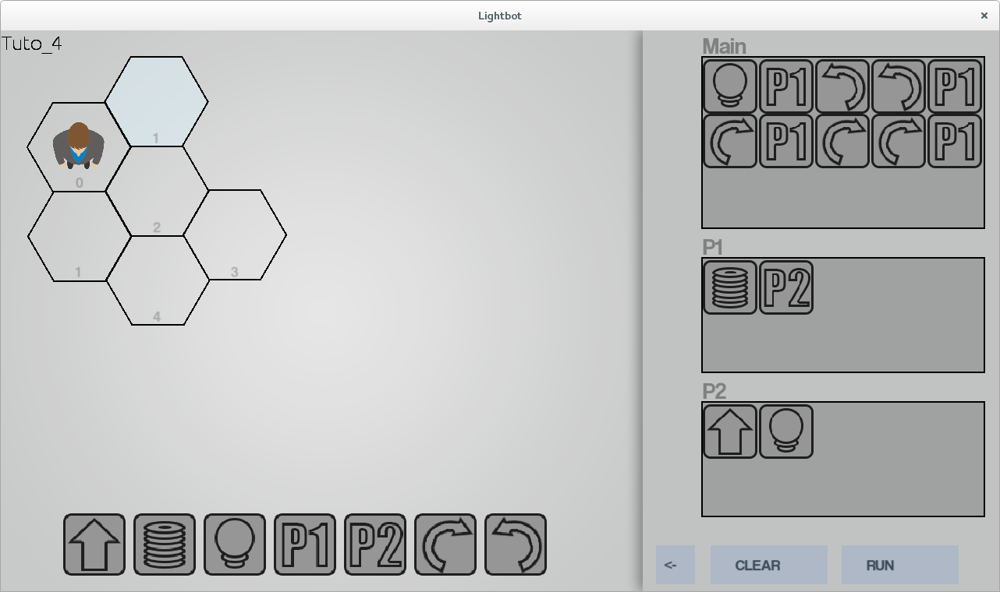

# Lightbot

 

Lightbot is an educational video game to learn software programming concepts. Made for the Introduction to OOP & OOP design course at the Bordeaux Institute of Technology (grade: 16/20).

## 1. Getting started
### 1.1 Prerequisites
- SFML

### 1.2 Setting up your dev environment
Open the project with Qt, it should work if you have the prerequisites.

### 1.4 Documentation
Here is the [documentation](docs).

## 2. Miscellaneous
### 2.1 Changelog
The changelog is available [here](CHANGELOG.md).

### 2.2 Authors
- **N3ROO** - *Initial work* - [Github](https://github.com/N3ROO) [Website](https://n3roo.github.io/)
- **T. Renaudon** - *Initial work*

### 2.3 License
This project is licensed under the GPL-3.0 license - see the [LICENSE](LICENSE.md) file for details